# XY Stock 股票分析系统

> 更新时间：2025-12-07 22:48:54

## 项目愿景

XY Stock 是一个极简而强大的股票/基金分析工具，专注于中国A股市场，结合实时行情数据和AI大模型分析，为投资者提供智能化、个性化的投资决策支持。项目致力于解决信息过载问题，通过AI深度推理将复杂数据转化为清晰的投资建议。

## 架构总览

系统采用分层模块化架构，通过数据获取、AI分析和可视化展示三大核心模块，实现从原始数据到投资建议的全流程自动化处理。

### 核心架构特点
- **模块化设计**：各功能模块高度解耦，便于维护和扩展
- **数据缓存机制**：有效减少API调用，提升响应速度
- **多模型支持**：兼容OpenAI、DeepSeek、阿里百炼等多种大模型
- **容器化部署**：基于Docker的轻量化部署方案
- **配置驱动**：通过TOML配置文件灵活控制系统行为

### 技术栈
- **前端框架**：Streamlit 1.48.0+
- **核心语言**：Python 3.11
- **数据源**：akshare、tushare、yfinance等
- **AI集成**：OpenAI API、LangChain
- **部署方案**：Docker + Docker Compose

## ✨ 模块结构图

```mermaid
graph TD
    A["(根) XY Stock"] --> B["backtesting"];
    A --> C["llm"];
    A --> D["market"];
    A --> E["stock"];
    A --> F["ui"];
    A --> G["utils"];
    A --> H["tests"];

    B --> B1["策略回测引擎"];
    B --> B2["可视化工具"];

    C --> C1["OpenAI客户端"];
    C --> C2["使用日志记录"];

    D --> D1["市场数据获取"];
    D --> D2["市场AI分析"];
    D --> D3["K线数据管理"];

    E --> E1["股票数据获取"];
    E --> E2["股票AI分析"];
    E --> E3["ETF持仓分析"];
    E --> E4["筹码数据分析"];

    F --> F1["Streamlit应用"];
    F --> F2["页面组件"];
    F --> F3["UI配置"];

    G --> G1["数据格式化"];
    G --> G2["报告生成"];
    G --> G3["风险指标"];
    G --> G4["绘图工具"];

    click B "./backtesting/CLAUDE.md" "查看回测模块文档"
    click C "./llm/CLAUDE.md" "查看LLM模块文档"
    click D "./market/CLAUDE.md" "查看市场模块文档"
    click E "./stock/CLAUDE.md" "查看股票模块文档"
    click F "./ui/CLAUDE.md" "查看UI模块文档"
    click G "./utils/CLAUDE.md" "查看工具模块文档"
    click H "./tests/CLAUDE.md" "查看测试模块文档"
```



## 模块索引

| 模块名称 | 路径 | 主要职责 | 核心文件 | 测试覆盖 |
|---------|------|----------|----------|----------|
| **backtesting** | `backtesting/` | 策略回测与绩效分析 | `backtest.py`, `visualizer.py` | 待完善 |
| **llm** | `llm/` | 大模型接口封装 | `openai_client.py`, `usage_logger.py` | 待完善 |
| **market** | `market/` | 市场数据获取与分析 | `market_data_fetcher.py`, `market_ai_analysis.py` | 部分 |
| **stock** | `stock/` | 个股数据获取与分析 | `stock_data_fetcher.py`, `stock_ai_analysis.py` | 部分 |
| **ui** | `ui/` | Streamlit Web界面 | `app.py`, `components/` | 待完善 |
| **utils** | `utils/` | 通用工具函数 | `data_formatters.py`, `report_utils.py` | 待完善 |

## 运行与开发

### 快速启动

```bash
# 方式一：Docker部署（推荐）
docker compose up -d

# 方式二：本地开发
pip install -r requirements.txt
python -m streamlit run ui/app.py --server.address=0.0.0.0 --server.port=8811
```

### 开发环境配置

1. **配置文件**：复制 `config_default.toml` 为运行时配置
2. **API密钥**：在配置中设置大模型API密钥
3. **数据源**：配置akshare、tushare等数据源的认证信息
4. **缓存目录**：确保 `data/` 目录有写权限

### 调试与测试

```bash
# 运行股票报告测试
python tests/test_stock_report.py

# 运行市场报告测试
python tests/test_market_report.py
```

## 测试策略

### 当前测试覆盖
- **股票报告生成测试**：验证数据获取和报告生成流程
- **市场报告生成测试**：验证指数分析和报告生成流程

### 测试增强建议
1. **单元测试**：为每个模块添加核心功能的单元测试
2. **集成测试**：测试模块间的数据流转和交互
3. **性能测试**：验证数据缓存和并发处理能力
4. **UI测试**：自动化测试Streamlit界面功能

## 编码规范

### Python代码规范
- 遵循 PEP 8 编码风格
- 使用类型注解提升代码可读性
- 函数和类必须有文档字符串
- 异常处理要明确和具体

### 项目结构规范
- 每个模块包含 `__init__.py` 文件
- 配置文件统一使用 TOML 格式
- 日志文件统一存放在 `logs/` 目录
- 缓存数据统一存放在 `data/` 目录

### 提交规范
- feat: 新功能
- fix: 修复bug
- docs: 文档更新
- style: 代码格式调整
- refactor: 代码重构
- test: 测试相关
- chore: 构建或辅助工具的变动

## AI 使用指引

### 支持的AI模型
- **OpenAI系列**：GPT-4o、GPT-4o-mini等
- **DeepSeek系列**：deepseek-chat、deepseek-reasoner
- **阿里百炼**：qwen-plus、qwen-max等
- **其他兼容OpenAI API的服务**

### 提示词优化
- 技术分析提示词注重风险指标评估
- 基本面分析提示词关注多维度财务数据
- 新闻分析提示词强调事件影响解读
- 综合分析提示词整合所有维度的信息

### 成本控制
- 实施token使用统计和日志记录
- 采用缓存机制减少重复API调用
- 根据分析类型选择合适的模型
- 支持设置请求频率限制

## 部署指南

### Docker部署

```yaml
# docker-compose.yml 核心配置
version: '3.8'
services:
  xystock:
    image: xieyan800811/xystock:latest
    ports:
      - "8811:8811"
    volumes:
      - ./data:/app/data
      - ./logs:/app/logs
```

### 生产环境注意事项
1. **数据持久化**：挂载data和logs目录
2. **安全配置**：使用环境变量管理敏感信息
3. **资源限制**：设置合适的CPU和内存限制
4. **日志轮转**：配置日志文件轮转策略

## 常见问题

### Q: 如何添加新的数据源？
A: 在相应的模块（stock或market）中创建新的fetcher类，继承基础数据获取接口。

### Q: 如何自定义AI分析提示词？
A: 修改 `stock/analysis_prompts.py` 中的提示词模板。

### Q: 如何扩展新的技术指标？
A: 在 `utils/risk_metrics.py` 或相关工具文件中添加新的计算函数。

### Q: 如何优化系统性能？
A:
- 启用数据缓存减少API调用
- 使用异步处理提升并发能力
- 优化数据库查询和数据结构

## 扩展方向

### 短期优化
1. 增加更多技术指标和分析工具
2. 完善回测模块的策略库
3. 增强报告导出功能（PDF、Excel）
4. 优化移动端适配

### 中长期规划
1. 支持港股、美股等更多市场
2. 集成机器学习预测模型
3. 开发移动端APP
4. 构建投资组合管理功能

## 变更记录

### 2025-12-07 22:48:54
- ✨ 完成项目初始化架构分析
- 📊 生成模块结构图和索引
- 🔧 创建各模块的CLAUDE.md文档
- 📈 统计代码覆盖率为69.2%

---

*提示：点击上方模块名称或Mermaid图表中的节点可快速跳转到对应模块的详细文档。*